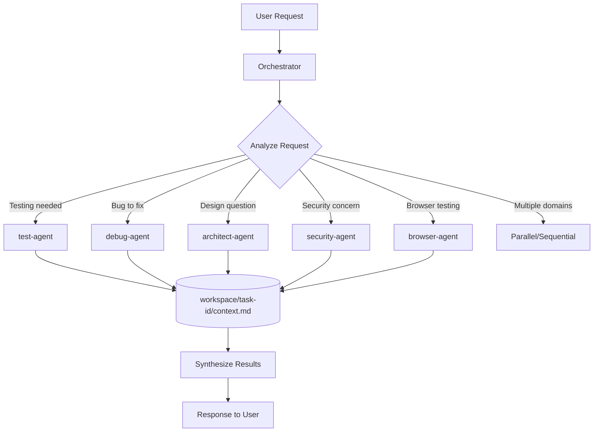
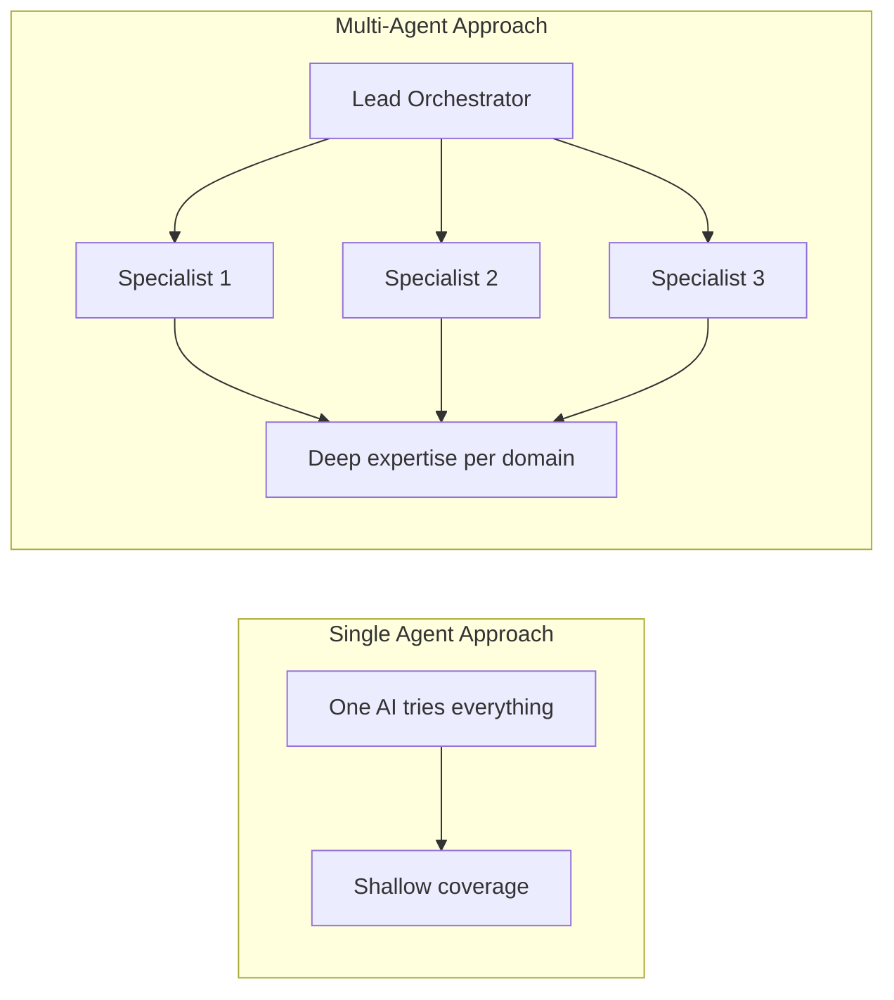
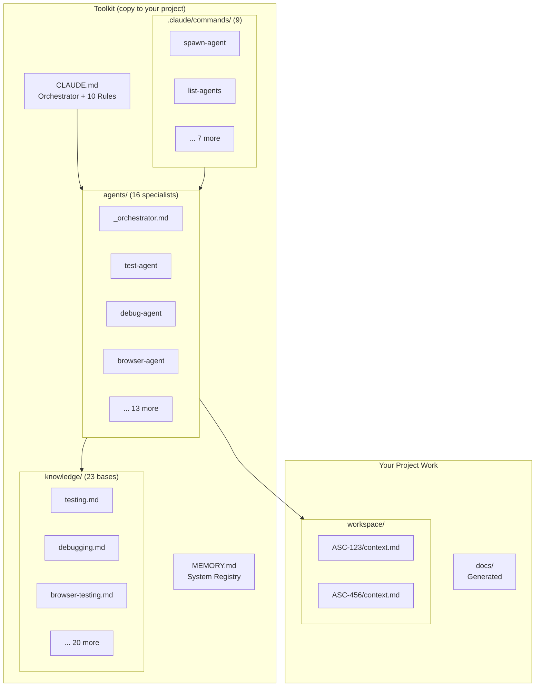
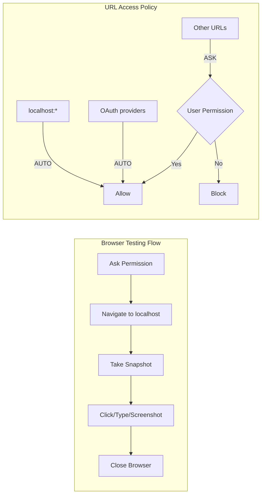
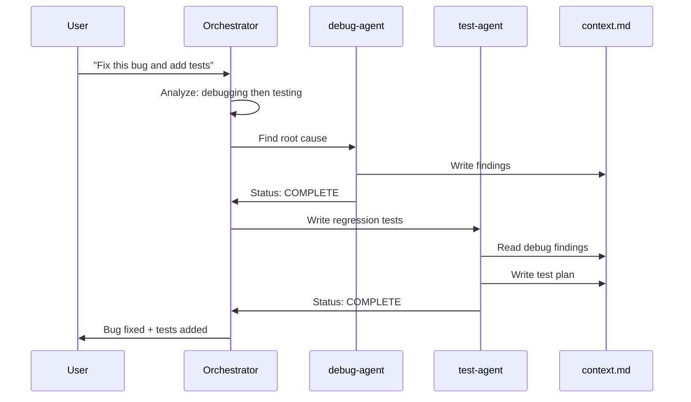
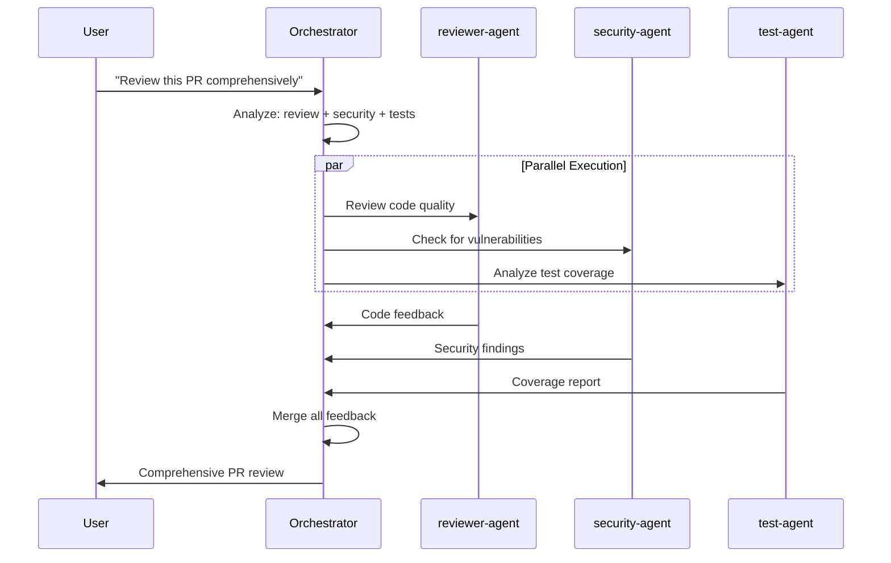
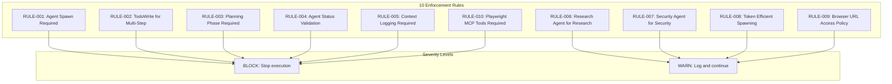
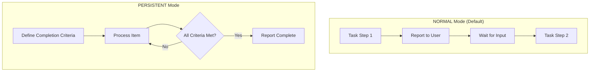
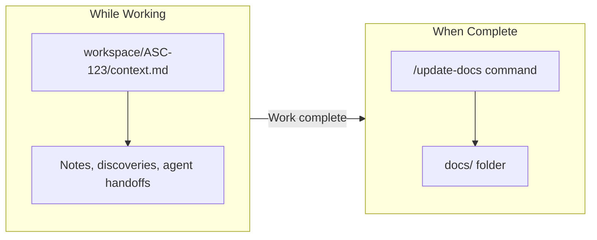

# Claude Multi-Agent Orchestration Toolkit

A plug-and-play toolkit that supercharges Claude Code with specialized AI agents. Copy this into any project to get automatic task delegation, rich context management, and multi-agent collaboration.

## System Overview

```
16 Specialist Agents | 23 Knowledge Bases | 10 Enforcement Rules | 9 Slash Commands
```

---

## How It Works



### The Flow

1. **User makes a request** - Orchestrator receives it
2. **Orchestrator analyzes** - Determines which specialist(s) are needed
3. **Planning phase** - Creates task workspace and plan (RULE-003)
4. **Spawns specialist agent(s)** - Each with focused role + domain knowledge
5. **Agents work & share context** - Via `workspace/[task-id]/context.md`
6. **Results synthesized** - Unified response back to user

---

## Why Specialization Works: The Research

### The Problem with Generalist AI

When you ask one AI to handle testing AND debugging AND architecture AND security simultaneously, performance degrades:

| Problem | Impact | Source |
|---------|--------|--------|
| **Context competition** | Information in the middle of prompts gets less attention | [Lost in the Middle (Stanford, 2023)](https://arxiv.org/abs/2307.03172) |
| **Role diffusion** | Without clear role, responses are generic | [Role-Play Prompting (arXiv)](https://arxiv.org/abs/2308.07702) |
| **Cognitive overload** | Too many domains = shallow coverage of each | [Chain-of-Thought (Google, 2022)](https://arxiv.org/abs/2201.11903) |

### The Multi-Agent Solution

Anthropic's own research shows **multi-agent systems outperform single agents by 90%** on complex tasks:

> "A multi-agent system with Claude Opus 4 as the lead agent and Claude Sonnet 4 subagents outperformed single-agent Claude Opus 4 by 90.2% on our internal research eval."
>
> — [How we built our multi-agent research system](https://www.anthropic.com/engineering/multi-agent-research-system)



---

## Architecture Diagram



---

## The 16 Specialist Agents

| Agent | Expertise | When Spawned |
|-------|-----------|--------------|
| `test-agent` | TDD, coverage, mocking | Writing/analyzing tests |
| `debug-agent` | Root cause analysis | Bug fixing, errors |
| `architect-agent` | SOLID, design patterns | Architecture decisions |
| `reviewer-agent` | Code quality | PR reviews |
| `docs-agent` | Documentation | Writing docs |
| `estimator-agent` | Story points | Ticket estimation |
| `ui-agent` | Frontend implementation | UI work, mockups |
| `workflow-agent` | Execution planning | Complex implementations |
| `research-agent` | Web research | Fact-checking, learning |
| `security-agent` | OWASP, vulnerabilities | Security audits |
| `refactor-agent` | Code smells | Technical debt |
| `explore-agent` | Codebase understanding | Finding patterns |
| `performance-agent` | Profiling, optimization | Performance issues |
| `ticket-analyst-agent` | Requirements analysis | Clarifying vague requests |
| `compliance-agent` | Rule auditing | Checking rule adherence |
| `browser-agent` | Playwright MCP | Interactive browser testing |

---

## Interactive Browser Testing (NEW)

The `browser-agent` enables real-time browser control using Playwright MCP - without writing code.



### Key Features

| Feature | Behavior |
|---------|----------|
| **Localhost** | Auto-allowed (no prompts) |
| **OAuth flows** | Auto-allowed (B2C, Auth0, Google, etc.) |
| **External URLs** | Ask permission first |
| **Production URLs** | Detect and warn |
| **Session lifecycle** | Ask before start, close when done |

### MCP Tool Usage (RULE-010)

The browser-agent uses Playwright MCP tools **directly** - never writes code:

```
mcp__playwright_browser_navigate  - Go to URL
mcp__playwright_browser_snapshot  - See page state
mcp__playwright_browser_click     - Click elements
mcp__playwright_browser_type      - Enter text
mcp__playwright_browser_close     - End session
```

---

## Sequential vs Parallel Delegation

### Sequential: When Tasks Depend on Each Other



### Parallel: When Tasks Are Independent



---

## Rule Enforcement System

The toolkit enforces 10 machine-readable rules via CLAUDE.md:



### Rule Format

```markdown
### RULE-001: Agent Spawn Required
- **TRIGGER**: Before Write/Edit on code
- **CONDITION**: Agent has been spawned
- **ACTION**: STOP, spawn appropriate agent
- **SEVERITY**: BLOCK
```

### Compliance Protocol

Before every action, the orchestrator self-checks:
- Has an agent been spawned for this code change?
- Is TodoWrite being used for multi-step tasks?
- Was planning phase completed?
- Did last agent report status?

For long tasks, `compliance-agent` audits rule adherence every ~10 actions.

---

## Execution Modes: NORMAL vs PERSISTENT



| Mode | Behavior | Best For |
|------|----------|----------|
| **NORMAL** | Stop after each step, report, wait | Exploratory tasks, quick fixes |
| **PERSISTENT** | Continue until criteria met | "convert all files", "test until 90%" |

### Explicit Control
```
/set-mode persistent    # Enable PERSISTENT mode
/set-mode normal        # Enable NORMAL mode
/check-completion       # Verify completion criteria
```

---

## Memory & Context Flow



### `workspace/` = Working Memory

```
workspace/
├── ASC-914/
│   ├── context.md    <- Notes, findings, agent discoveries
│   ├── mockups/      <- Input references
│   ├── outputs/      <- Generated artifacts
│   └── snapshots/    <- Progress screenshots
```

### `docs/` = Polished Documentation

Run `/update-docs` after completing work to generate clean project docs.

---

## Slash Commands

| Command | Purpose |
|---------|---------|
| `/spawn-agent <name> <task-id>` | Spawn an agent with context |
| `/agent-status <task-id>` | Check task status |
| `/list-agents` | List all available agents |
| `/check-task <task-id>` | Validate task folder structure |
| `/plan-task <task-id> <desc>` | Execute planning phase only |
| `/compact-review` | Preview state before compaction |
| `/update-docs` | Generate documentation |
| `/set-mode <mode>` | Set NORMAL or PERSISTENT mode |
| `/check-completion` | Verify completion criteria |

---

## Quick Start

1. **Copy into your project**:
   ```bash
   # Copy these folders/files to your project root:
   .claude/       # Settings, commands
   agents/        # Agent definitions
   knowledge/     # Domain expertise
   workspace/     # Task tracking (starts empty)
   CLAUDE.md      # Orchestrator instructions
   MEMORY.md      # System registry
   ```

2. **Start Claude Code** in your project

3. **Work normally** - The system delegates automatically

---

## File Structure

```
ClaudeMemory/
├── CLAUDE.md              # Orchestrator + 10 rules
├── MEMORY.md              # System registry
├── .claude/
│   ├── settings.json      # Permissions, hooks, sandbox
│   └── commands/          # 9 slash commands
├── agents/                # 16 specialist agents
│   ├── _orchestrator.md   # Detailed routing
│   ├── _shared-output.md  # Common output format
│   ├── test-agent.md
│   ├── debug-agent.md
│   ├── browser-agent.md
│   └── ... (13 more)
├── knowledge/             # 23 knowledge bases
│   ├── testing.md
│   ├── debugging.md
│   ├── browser-testing.md
│   └── ... (20 more)
├── workspace/             # Task-organized work
│   └── [task-id]/
│       ├── context.md
│       ├── mockups/
│       ├── outputs/
│       └── snapshots/
└── docs/                  # Auto-generated
```

---

## Token Efficiency

| Optimization | Savings |
|--------------|---------|
| Agents READ files vs pasted content | ~97% reduction per spawn |
| Single source of truth (no duplicates) | ~700 tokens/session |
| Lazy loading (knowledge on-demand) | Variable |

---

## Key Principles

1. **Specialists > Generalists** - Focused agents outperform jack-of-all-trades
2. **Per-task isolation** - Each issue has its own context folder
3. **Status-driven handoffs** - Agents report COMPLETE/BLOCKED/NEEDS_INPUT
4. **File-based memory** - Survives context compaction and session resets
5. **Token efficient** - Minimal overhead, maximum capability
6. **Completion verification** - Never say "done" without verifying criteria
7. **Rule enforcement** - 10 machine-readable rules with compliance checking
8. **Defense-in-depth** - Multiple layers for safety (rules, prompts, permissions)

---

## Research & Sources

### Primary References

- **[Anthropic Multi-Agent Research System](https://www.anthropic.com/engineering/multi-agent-research-system)** - 90% improvement over single-agent

- **[Chain-of-Thought Prompting (Google, 2022)](https://arxiv.org/abs/2201.11903)** - Step-by-step reasoning in LLMs

- **[Role-Play Prompting (arXiv)](https://arxiv.org/abs/2308.07702)** - Role prompting improves zero-shot reasoning

### Framework Inspiration

- **[MetaGPT](https://github.com/FoundationAgents/MetaGPT)** - Multi-agent software development (ICLR 2025)

- **[CrewAI](https://docs.crewai.com/)** - Role-based agent collaboration patterns

- **[LLM Multi-Agent Survey (IJCAI 2024)](https://github.com/taichengguo/LLM_MultiAgents_Survey_Papers)** - Comprehensive survey

### Browser Testing References

- **[Playwright MCP](https://github.com/microsoft/playwright-mcp)** - Microsoft's official MCP server

- **[Simon Willison's TIL](https://til.simonwillison.net/claude-code/playwright-mcp-claude-code)** - Playwright MCP with Claude Code

---

## License

MIT
