# Claude Multi-Agent Orchestration Toolkit

A plug-and-play toolkit that supercharges Claude Code with specialized AI agents. Copy this into any project to get automatic task delegation, rich context management, and multi-agent collaboration.

## How It Works

```mermaid
flowchart TB
    User[👤 User Request] --> Orchestrator[🎯 Orchestrator]

    Orchestrator --> Analyze{Analyze Request}
    Analyze --> |"Testing needed"| TestAgent[🧪 test-agent]
    Analyze --> |"Bug to fix"| DebugAgent[🔍 debug-agent]
    Analyze --> |"Design question"| ArchAgent[🏗️ architect-agent]
    Analyze --> |"Security concern"| SecAgent[🔒 security-agent]
    Analyze --> |"Multiple domains"| Parallel[Parallel/Sequential]

    TestAgent --> Context[(workspace/task-id/context.md)]
    DebugAgent --> Context
    ArchAgent --> Context
    SecAgent --> Context

    Context --> Synthesize[📋 Synthesize Results]
    Synthesize --> Response[✅ Response to User]
```



### The Flow

1. **User makes a request** → Orchestrator receives it
2. **Orchestrator analyzes** → Determines which specialist(s) are needed
3. **Spawns specialist agent(s)** → Each with focused role + domain knowledge
4. **Agents work & share context** → Via `workspace/[task-id]/context.md`
5. **Results synthesized** → Unified response back to user

---

## Why Specialization Works: The Research

### The Problem with Generalist AI

When you ask one AI to handle testing AND debugging AND architecture AND security simultaneously, performance degrades. Research shows why:

| Problem | Impact | Source |
|---------|--------|--------|
| **Context competition** | Information in the middle of prompts gets less attention | [Lost in the Middle (Stanford, 2023)](https://arxiv.org/abs/2307.03172) |
| **Role diffusion** | Without clear role, responses are generic | [Role-Play Prompting (arXiv)](https://arxiv.org/abs/2308.07702) |
| **Cognitive overload** | Too many domains = shallow coverage of each | [Chain-of-Thought (Google, 2022)](https://arxiv.org/abs/2201.11903) |

### The Multi-Agent Solution

Anthropic's own research shows **multi-agent systems outperform single agents by 90%** on complex tasks:

> "A multi-agent system with Claude Opus 4 as the lead agent and Claude Sonnet 4 subagents outperformed single-agent Claude Opus 4 by 90.2% on our internal research eval."
>
> — [How we built our multi-agent research system](https://www.anthropic.com/engineering/multi-agent-research-system)

```mermaid
flowchart LR
    subgraph Single["❌ Single Agent Approach"]
        One[One AI tries everything] --> Shallow[Shallow coverage]
    end

    subgraph Multi["✅ Multi-Agent Approach"]
        Lead[Lead Orchestrator] --> S1[Specialist 1]
        Lead --> S2[Specialist 2]
        Lead --> S3[Specialist 3]
        S1 --> Deep[Deep expertise per domain]
        S2 --> Deep
        S3 --> Deep
    end
```



### Why Role Prompting Improves Results

When you tell an AI "You are a senior security engineer" vs just asking about security:

- **Reasoning improves** - Role-play prompting acts as an implicit Chain-of-Thought trigger ([arXiv:2308.07702](https://arxiv.org/abs/2308.07702))
- **Domain knowledge activates** - The model draws on relevant training more effectively
- **Consistency increases** - Responses stay focused on the domain

This toolkit gives each agent a complete role definition (Role, Goal, Backstory, Capabilities) plus domain-specific knowledge.

---

## Architecture Diagram

```mermaid
flowchart TB
    subgraph Toolkit["📦 Toolkit (copy to your project)"]
        CLAUDE[CLAUDE.md<br/>Orchestrator Instructions]
        MEMORY[MEMORY.md<br/>System Registry]

        subgraph Agents["agents/"]
            Orch[_orchestrator.md]
            Test[test-agent.md]
            Debug[debug-agent.md]
            Arch[architect-agent.md]
            More[... 11 more agents]
        end

        subgraph Knowledge["knowledge/"]
            Testing[testing.md]
            Debugging[debugging.md]
            Security[security.md]
            MoreK[... 16 more]
        end
    end

    subgraph Project["🏗️ Your Project Work"]
        subgraph Workspace["workspace/"]
            Task1[ASC-123/context.md]
            Task2[ASC-456/context.md]
        end

        Docs[docs/<br/>Generated when done]
    end

    CLAUDE --> Agents
    Agents --> Knowledge
    Agents --> Workspace
    Workspace --> |"/update-docs"| Docs
```



---

## Sequential vs Parallel Delegation

### Sequential: When Tasks Depend on Each Other

```mermaid
sequenceDiagram
    participant U as User
    participant O as Orchestrator
    participant D as debug-agent
    participant T as test-agent
    participant C as context.md

    U->>O: "Fix this bug and add tests"
    O->>O: Analyze: debugging → testing (sequential)
    O->>D: Find root cause
    D->>C: Write findings
    D->>O: Status: COMPLETE
    O->>T: Write regression tests (read context first)
    T->>C: Read debug findings
    T->>C: Write test plan
    T->>O: Status: COMPLETE
    O->>U: Bug fixed + tests added
```



### Parallel: When Tasks Are Independent


---

## The 14 Specialist Agents

| Agent | Expertise | When Spawned |
|-------|-----------|--------------|
| `test-agent` | TDD, coverage, mocking | Writing/analyzing tests |
| `debug-agent` | Root cause analysis | Bug fixing, errors |
| `architect-agent` | SOLID, design patterns | Architecture decisions |
| `reviewer-agent` | Code quality | PR reviews |
| `docs-agent` | Documentation | Writing docs |
| `estimator-agent` | Story points | Ticket estimation |
| `ui-agent` | Frontend implementation | UI work, mockups |
| `workflow-agent` | Execution planning | Complex implementations |
| `research-agent` | Web research | Fact-checking, learning |
| `security-agent` | OWASP, vulnerabilities | Security audits |
| `refactor-agent` | Code smells | Technical debt |
| `explore-agent` | Codebase understanding | Finding patterns |
| `performance-agent` | Profiling, optimization | Performance issues |
| `ticket-analyst-agent` | Requirements analysis | Clarifying vague requests |

---

## Memory & Documentation Flow


### `workspace/` = Working Memory (Scratchpad)

```
workspace/
├── ASC-914/
│   ├── context.md    ← Notes, findings, what agents discovered
│   ├── mockups/      ← Input references
│   ├── outputs/      ← Generated artifacts
│   └── snapshots/    ← Progress screenshots
```

### `docs/` = Polished Documentation (When Done)

Run `/update-docs` after completing work to generate clean project docs.

---

## Quick Start

1. **Copy into your project**:
   ```bash
   # Copy these folders/files to your project root:
   .claude/       # Settings, commands
   agents/        # Agent definitions
   knowledge/     # Domain expertise
   workspace/     # Task tracking (starts empty)
   CLAUDE.md      # Orchestrator instructions
   MEMORY.md      # System registry
   ```

2. **Start Claude Code** in your project

3. **Work normally** - The system delegates automatically

---

## Token Efficiency

This toolkit minimizes token usage:

| Optimization | Savings |
|--------------|---------|
| Agents READ files vs pasted content | ~97% reduction per spawn |
| Single source of truth (no duplicates) | ~700 tokens/session |
| Lazy loading (knowledge on-demand) | Variable |

---

## Research & Sources

### Primary References

- **[Anthropic Multi-Agent Research System](https://www.anthropic.com/engineering/multi-agent-research-system)** - How Anthropic built their own multi-agent system, showing 90% improvement over single-agent

- **[Chain-of-Thought Prompting (Google, 2022)](https://arxiv.org/abs/2201.11903)** - Foundational research on step-by-step reasoning in LLMs

- **[Role-Play Prompting (arXiv)](https://arxiv.org/abs/2308.07702)** - Research showing role prompting improves zero-shot reasoning

### Framework Inspiration

- **[MetaGPT](https://github.com/FoundationAgents/MetaGPT)** - Multi-agent software development framework (ICLR 2025)

- **[CrewAI](https://docs.crewai.com/)** - Role-based agent collaboration patterns

- **[LLM Multi-Agent Survey (IJCAI 2024)](https://github.com/taichengguo/LLM_MultiAgents_Survey_Papers)** - Comprehensive survey of multi-agent approaches

### Additional Reading

- [A Survey on LLM-based Multi-Agent Systems](https://arxiv.org/abs/2412.17481) - Recent advances and frontiers
- [Google Research: Chain of Thought](https://research.google/blog/language-models-perform-reasoning-via-chain-of-thought/) - Visual explanation of CoT

---

## Key Principles

1. **Specialists > Generalists** - Focused agents outperform jack-of-all-trades
2. **Per-task isolation** - Each issue has its own context folder
3. **Status-driven handoffs** - Agents report COMPLETE/BLOCKED/NEEDS_INPUT
4. **File-based memory** - Survives context compaction and session resets
5. **Token efficient** - Minimal overhead, maximum capability
